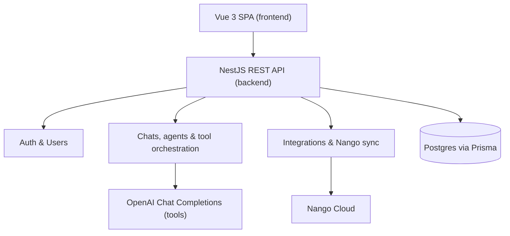
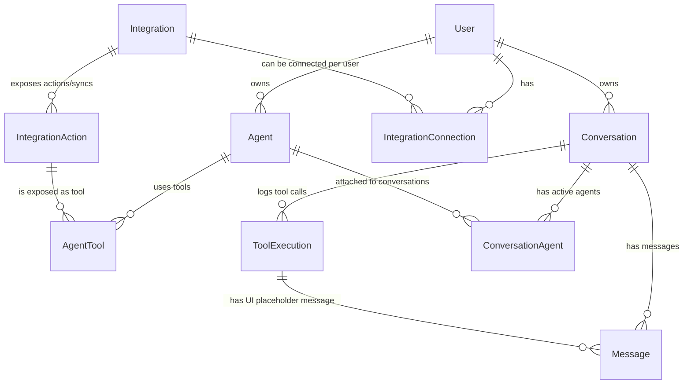
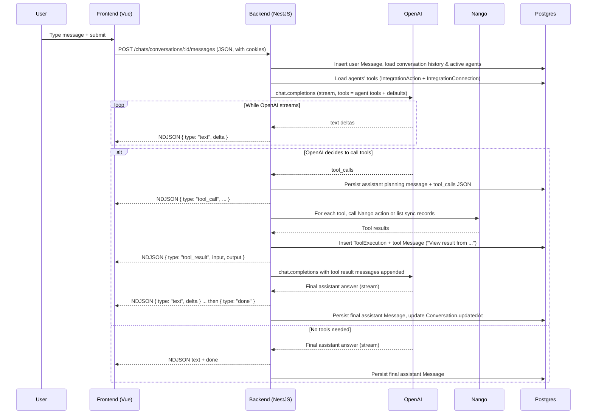

## GHL Agent Studio – Architecture

Minimal agent studio that lets a user:
- define agents with prompts and tools backed by Nango integrations
- chat with those agents with streaming responses and tool-calling

The repo is split into a `frontend` (Vue 3 + Vite) and a `backend` (NestJS + Prisma + Postgres).

Demo video: https://www.dropbox.com/scl/fi/p7giuyrdk5hynopwi411x/Demo.mp4?rlkey=8r1xztpu9l1p7vq1r4kozwlsj&dl=0

### System architecture

- **Frontend**: Single-page app that handles auth, chat UI, agent management, and integration management.
- **Backend**: NestJS app exposing JSON APIs for auth, agents, chats, and integrations, plus an NDJSON streaming endpoint for chat.
- **OpenAI**: Used for both conversation replies and agent tool-calling (function calling).
- **Nango**: Manages OAuth flows and hosts integration actions/syncs that are exposed as tools to agents.
- **Database**: Postgres schema managed via Prisma.

### Data model / schema design

Core entities (see `backend/prisma/schema.prisma` for exact fields and constraints):

- **User**: Basic profile + `passwordHash`. Owns agents, conversations, and integration connections.
- **Integration / IntegrationAction**: Synced from Nango; represent providers and their actions/syncs, including JSON schema for tool parameters.
- **IntegrationConnection**: Concrete OAuth/Nango connection for a given user and integration.
- **Agent / AgentTool**: Agent has a `systemPrompt` and one or more tools mapped to `IntegrationAction`s.
- **Conversation / Message / ToolExecution / ConversationAgent**:
  - `Conversation` is a chat thread per user.
  - `Message` stores user, assistant, and tool messages.
  - `ToolExecution` captures structured tool input/output and status.
  - `ConversationAgent` links which agents are active in a given conversation.

### Agent execution & tool-calling flow

The frontend keeps an optimistic local transcript (`displayMessages`) and reconciles with the persisted messages after each `done` event.

### Security considerations

- **Authentication & session storage**
  - Backend issues a JWT access token; frontend relies on `credentials: "include"` so the token is stored and sent via HTTP-only cookies (no manual token storage in JS).
  - Simple email/password signup + login with bcrypt, no password reset or MFA.
- **Secret management**
  - Sensitive keys (`OPENAI_API_KEY`, `NANGO_SECRET_KEY`, `DATABASE_URL`, JWT secret) are read from environment variables and never returned in responses.
  - Secrets are intended to be provided via local env files or deployment configuration, not checked into git.
- **CORS / transport**
  - API base URL is configurable via `VITE_API_BASE_URL`; CORS is configured on the NestJS side to allow the frontend origin with credentials.
  - All traffic is intended to go over HTTPS in real deployments.
- **Authorization boundaries**
  - All chat, agent, and integration endpoints enforce user ownership via Prisma queries and explicit checks (e.g. conversation-user matching, agent-user matching).
  - Integration tools run only if there is an active `IntegrationConnection` for the current user and integration.

### What is fully functional vs. stubbed or simplified

- **Fully functional**
  - End-to-end signup/login and authenticated session via cookies.
  - Agent CRUD with `systemPrompt` and tool selection backed by Nango integration actions/syncs.
  - Integration sync from Nango (metadata + actions/syncs), per-user connection status, connect/disconnect flows.
  - Chat experience: conversation list, titles, streaming responses, tool-calling, and viewing structured tool inputs/outputs.
  - Persistence of all entities in Postgres via Prisma.
- **Simplified or intentionally omitted**
  - **Model selection per agent/tool**: fixed model (`gpt-4o-mini`) to keep the focus on tools and orchestration.
  - **Multi-user collaboration in a conversation**: every conversation belongs to a single user; no shared threads.
  - **Scheduling & long-running workflows**: no background jobs, schedulers, or workflow engine; all tool calls are synchronous in-request.
  - **Triggers beyond chat**: only chat-triggered executions are supported (no webhooks, cron, or event-based triggers).
  - **Multiple accounts for the same integration per user**: each user has at most one `IntegrationConnection` per integration.
  - **Periodic health checks**:
    - No background polling for connection health (`IntegrationConnection.status` is refreshed only on demand).
    - No automatic polling for “new integrations available” beyond startup sync from Nango.
  - **Operational tooling**: limited logging and basic error handling; no dashboards or metrics.

### Path to a production-grade, multi-tenant system

This codebase is intentionally small and monolithic; below is how it would evolve for production:

- **Multi-tenancy & organizations**
  - Introduce `Organization` and `OrganizationMember` models; scope users, agents, conversations, and integrations by organization.
  - Enforce organization scoping at the API and data-access layers (e.g. Prisma middlewares or request-scoped tenant context).
- **Prompt and configuration tracking**
  - Version prompts and agent definitions, storing who changed what and when.
  - Log prompt + tool configuration per conversation turn for auditability and offline analysis.
- **Resilience: retries, rate limits, circuit breakers**
  - Wrap OpenAI and Nango clients with retry policies (backoff + jitter), per-provider and per-tenant rate limiting, and circuit breakers for outage isolation.
  - Standardize error envelopes so the frontend can distinguish transient vs. permanent failures.
- **Asynchronous execution & queues**
  - Move integration-heavy or long-running tool calls out of the request path using a queue (e.g. BullMQ, SQS) and worker processes.
  - Stream intermediate status updates to the client via websockets or server-sent events, reducing the risk of Nango/OpenAI rate limits in chat requests.
- **Database migrations & operations**
  - Switch from `prisma db push` to `prisma migrate deploy` and manage schema changes via migrations to avoid accidental column drops.
  - Add migrations + seed scripts to support staging/production environments and blue/green deploys.
- **Authentication & authorization**
  - Replace basic email/password-only auth with a hardened system: stronger password policies, password reset flows, optional SSO, and short-lived access tokens with refresh tokens.
  - Add role-based access control per organization (e.g. admin, editor, viewer) and per-feature permissions.
- **Service decomposition & observability**
  - Gradually split the monolith into services (auth, chat/LLM orchestration, integrations, UI backend) once complexity or scale requires it.
  - Add centralized logging, tracing, and metrics (e.g. OpenTelemetry) for debugging latency, failures, and provider spend.
